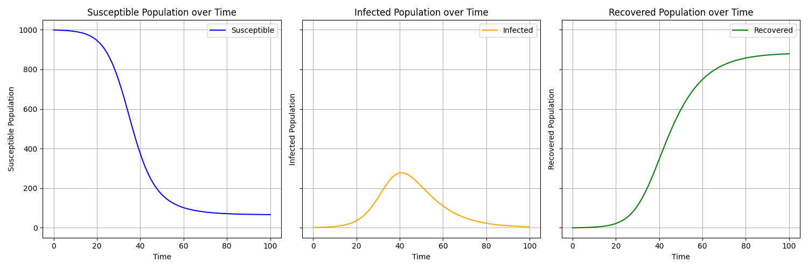
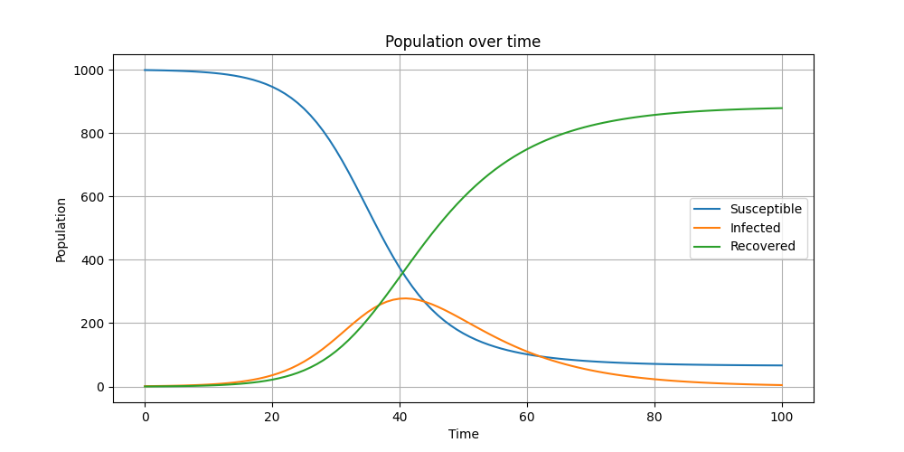

The SIR model divides the population into three categories: Susceptible (S), Infected (I), and Recovered (R). The model simulates how an infectious disease spreads and is managed within a population over time.

Static Population Model Output:

Animated Population Model Output:

Check out the configuration reference at https://huggingface.co/docs/hub/spaces-config-reference
